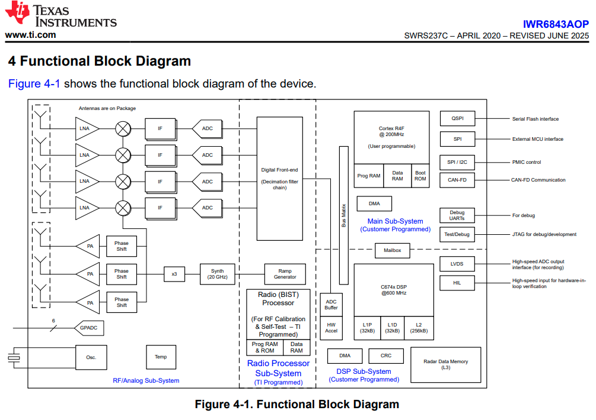

# mmWave sensor IWR6843AOPEVM

user guide: https://www.ti.com/lit/pdf/SWRU546

## Start up process

There are two phases.
1. Flash the data collection program to the module
2. Setup data collection config and start collecting

### Flash data collection program to the sensor:

1. Download the whole radar-toolbox from here: https://dev.ti.com/tirex/explore
2. extract and locate the demo binary file for your sensor here- radar_toolbox/source/ti/examples/Out_Of_Box_Demo/prebuilt_binaries
3. Download the TiCloudAgent application in your PC from here- https://software-dl.ti.com/ccs/esd/documents/ti_cloud_agent.html
4. Open TI demoVisualizer application from here: https://dev.ti.com/gallery/view/mmwave/mmWave_Demo_Visualizer/ver/3.6.0/  (set your sensor version etc. properly, you may need to change the visualizer version)
5. Plug the sensor in with the USB cable at the small end (emulator end).
6. Set the sensor mode to 'functional' mode by setting switch combinations shown in above image or follow the user guide (look for 'user guide' here: https://www.ti.com/tool/IWR6843AOPEVM#order-start-development)
7. Reset the sensor by pressing the reset button (its located near S2 in the above image)
8. Try to connect the hardware with this demo visualizer. Set the ports in `options/serial port configuration` and connect your sensor. It wont show the data but we can know which port is User port and which port is Data port.
9. Go to the uniflash application provided here: https://dev.ti.com/uniflash/
10. Change the sensor mode to 'flashing' by pressing switch combinations shown in the user guide
11. Reset your sensor by pressing the reset button
12. Set the port, upload the IWR6843AOPEVM demo binary file from the downloaded toolkit in step-1 and flash it to the sensor module
13. Change the sensor mode to 'functional' again and reset the sensor

### Data visualization
1. Plug the sensor in with the USB cable at the small end.
2. Make sure the sensor mode is set as 'functional' and reset the sensor
3. Open demoVisualizer application and connect the sensor by setting the ports. 
4. Set the configs and send the config to the sensor
5. Open plot panel, you can see the radar data plots there

Sensing Estimator cloud: https://dev.ti.com/gallery/view/mmwave/mmWaveSensingEstimator/ver/2.4.0/

## Development on data acquisition:

### General information:
- The mmwave radar sensor needs to flash a binary program which we do using uniflash. This is one time process to install the program.
- The flashed program can be modified by inserting the config parameters using CLI command port
- Demo bin file and default config:
    - demo binary: /mmwave_sdk_03_06_02_00-LTS/packages/ti/demo/xwr68xx/mmwxwr68xx_mmw_demo.bin   [inside downloaded sdk directory]
    - demo binary is also available from resource explorer: https://dev.ti.com/tirex/explore
    - configs:
        1. cloud-sensing-estimator app: https://dev.ti.com/gallery/view/mmwave/mmWaveSensingEstimator/ver/2.4.0/
        2. default config can also be found in https://github.com/kirkster96/IWR6843-Read-Data-Python-MMWAVE-SDK/blob/main/xwr68xxconfig.cfg
        3. can be created from demo-visualizer by ti
- We can acquire data using python in real-time, but we need to know the data parsing format.
- Serial UART data from sensor contains header + TLV data. The description for the format for the demo-binary can be found here- /mmwave_sdk_03_06_02_00-LTS/packages/ti/demo/xwr68xx/mmw/docs/doxygen/html/index.html
- The header and TLV format is programmed inside the demo binary file. So, if we change the binary file, the format will also change
- As described in the datasheet documentation, there are two main subsections where we can program the sensor.
    1. MSS (Master Sub System)
    2. DSS (DSP Sub System)
    Hence, the demo source code contains code for these two sections

### SDK installation:
1. Download the sdk from https://www.ti.com/tool/MMWAVE-SDK#downloads
2. On ubuntu, install additional libraries `sudo apt-get install libc6:i386 libgtk2.0-0:i386 libxtst6:i386`  (source: https://e2e.ti.com/support/sensors-group/sensors/f/sensors-forum/759934/linux-mmwave-sdk-cannot-install-mmwave-sdk-in-linux)

### Data acquisition python script:
- Prepare the python environment, install necessary libraries from requirements.txt
- Plug the usb cable to the mmWave sensor at the small end (emulator end)
- Make sure the sensor is in 'functional' mode
- Reset the sensor
- Make sure the .cfg file is okay and ending with "sensorStart"
- Run `run.py` script to start data acquisition from the ternimal
- Press Ctrl+C to exit the application of data acquisition

## Miscellaneous

### Note:
- If in ubuntu you are having trouble for port detection, it might be because of permission issue. You can use this command `sudo usermod -a -G dialout $USER` and restart your PC.
- The code uses the parsing modules provided by TI and subjects to changes from their demo preparation. You may need to tune the magicWord from the demo operation or some other items from the parsed data if necessary.

### Python repos for data reading-writing to sensor:
1. https://github.com/kirkster96/IWR6843-Read-Data-Python-MMWAVE-SDK
2. https://github.com/ibaiGorordo/IWR1443-Read-Data-Python-MMWAVE-SDK-1

### Resources:
- SysConfig tool:  https://dev.ti.com/sysconfig/#/config/?args=--device%20IWR6843AOP%20--package%20%22FCCSP%20P$OPEN$ALPP$CLOSE$%22%20--variant%20default
- Resource Explorer:  https://dev.ti.com/tirex/explore
- https://askubuntu.com/questions/941594/installing-cp210x-driver
- https://e2e.ti.com/support/sensors-group/sensors/f/sensors-forum/958334/xwr1843-xwr6843-mmwave-studio-cli-tool-is-available-on-ti-rex
- https://www.youtube.com/watch?v=qy6Xb7tWwfk&list=PLJAlx-5DOdePomvfyvcM5mrmgxptfYPoa&index=3
- https://www.youtube.com/watch?v=kZM69hHKFpY&list=PLJAlx-5DOdePomvfyvcM5mrmgxptfYPoa&index=7
- 